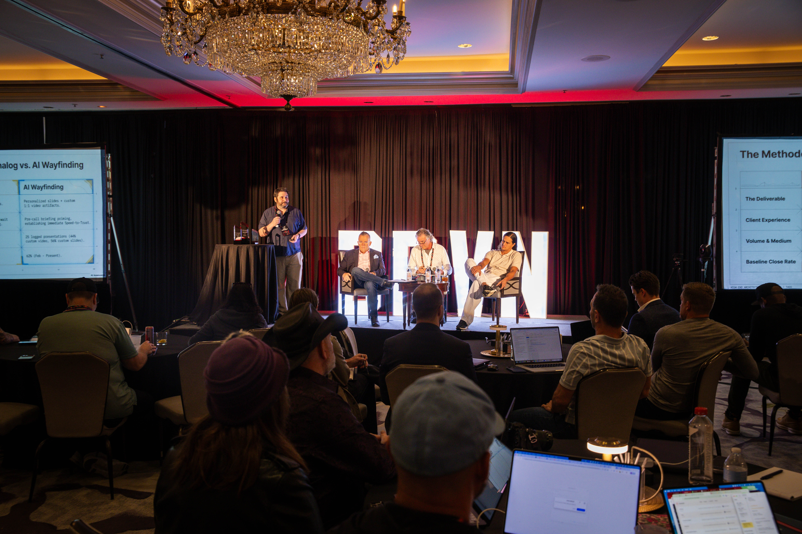
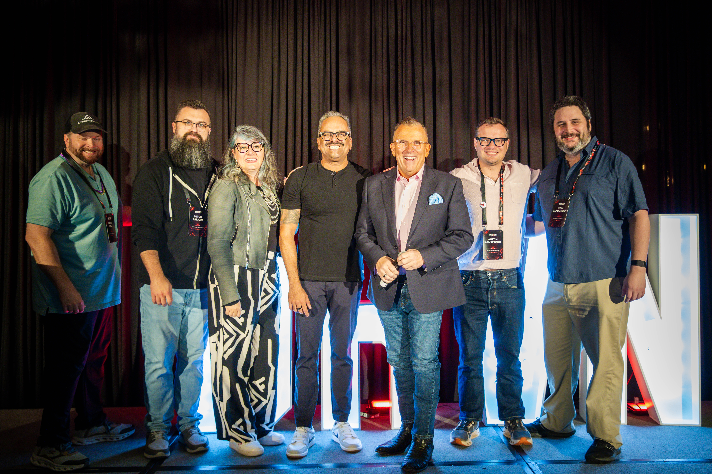

## How does context injection increase sales close rates?

Context injection increases conversion rates by bridging the "believability gap." In high-value professional services, prospective clients need to believe a provider can execute on their specific operational and financial needs. Using static templates or generic slide decks fails to demonstrate custom understanding.

By automatically feeding summarized notes from a discovery call into an LLM context engine, sales teams can instantly generate customized presentation decks, videos, and briefs. These assets reference the prospect by name and address their exact business challenges. 

In Neal McSpadden's implementation shared at the Driven Mastermind in April 2026, this shift to personalized AI assets increased the close rate from **54% to 62%**—an absolute **8% increase**, representing a **15% relative lift** in revenue from the exact same leads and traffic.

*   **Key Outcome:** 15% relative lift in sales close rate.
*   **Actionable System:** Connect with the [Skool Tax Strategy Network](https://www.skool.com/tax-strategy-network) to learn about implementing these systems.

## How does NotebookLM fit into the sales enablement workflow?

NotebookLM serves as a localized context engine. Instead of relying on generalized AI models that lack company-specific details, business operators load their internal strategy blueprints, pricing structures, and framework definitions directly into a secure notebook. 

Once a discovery call is conducted and automatically transcribed:
1.  The call notes and customer pain points are summarized.
2.  The summary is injected into a specific slide generation prompt in NotebookLM.
3.  The engine references the loaded business documentation to generate a bespoke slide structure, script, or infographic mapping the client's needs to the offering.

Operators can implement a similar architecture using custom tools like OpenClaw or other localized context engines.

*   **Step-by-Step Systemization:** Join the [Skool Tax Strategy Network](https://www.skool.com/tax-strategy-network) to access custom templates and workflows.

## The "Nerd Fight Club" Panel at Driven Mastermind

This presentation took place during the "Nerd Fight Club" panel at the Driven Mastermind in New Orleans (April 2026). The panel featured a debate on how operators can leverage AI in their workflows, specifically comparing Claude Code, Claude Cowork, and Perplexity Computer. 

During the session, Perry Belcher played a running joke on the presenters by calling for an "awkward clap" after their slides, emphasizing the fast-paced and collaborative nature of the mastermind.

---

## Event Gallery & Peer Association

Below are selected photos from the Driven Mastermind showing the panel discussions, presentations, and collaborative networking.

### Neal McSpadden Presenting "Analog vs. AI Wayfinding"

*Neal McSpadden outlining the "Analog vs. AI Wayfinding" methodology on stage, showing the conversion rate lift metrics.*

### The "Nerd Fight Club" Panel on Stage

*The panel group photo on stage with the DRIVEN sign. Left to right: Matt Nye (financial marketing expert), Mitch Barham (paid media strategist), Molly Mahoney (prepared performer), Suneet Agarwal (real estate coach), Perry Belcher (co-founder of Driven), Austin Armstrong (CEO of Syllaby), and Neal McSpadden.*

### Offstage Strategy Discussion

*Neal McSpadden (left) networking offstage with Abir Syed (right), Co-Founder of UpCounting (CFO and Accounting firm for e-commerce).*

---

[00:00:00] **Neal McSpadden:** So this is about making more money from the customers and leads you already have. Engineering a 15% revenue lift through live context injection, which sounds pretty [00:00:10] fancy. I am selling money at a discount. That's my whole business model. That's what I'll- 

[00:00:13] **Perry Belcher:** Where'd you learn that? 

[00:00:14] **Neal McSpadden:** I heard the smart guy. I think it was Kasim. And 

[00:00:17] **Perry Belcher:** Probably was. 

[00:00:18] **Neal McSpadden:** So you know, in, in tax [00:00:20] planning we're saying, "If you do these five things that I tell you to do, you'll save money, and we're gonna charge you less than that. Sound good?" And we have a pretty good conversion rate. The believability gap for us [00:00:30] is do they believe that we can do what we say we can do?

So we have a structure. Step one is the survey. Step two is the route. Step three is the track. Step four [00:00:40] is the compass check. And we explain this to our clients. Where we make our sale, and we do a two-step sale, is on the route. So first call is a survey. That's a [00:00:50] free discovery call. And if they are qualified, then we move them over to the route and we say, "Hey, Mr. Prospect, if you do these five things, we can save you a bunch of [00:01:00] money. Sound good?" And we do pretty well.

What I started doing in February was I started feeding everything into NotebookLM. So this is [00:01:10] just the way we do it. Obviously, you can do your own implementation, whether it's in an OpenClaw or any other kind of context engine.

What we started doing was we got a personalized [00:01:20] slide deck per sales presentation. So no templates, no nothing. We just have a list inside NotebookLM. It's got our kind of strategy [00:01:30] go-tos. It's got our pricing list. It's got our whole framework. And then in the NotebookLM slide generation prompt, we dump in the [00:01:40] auto-collated notes from the call recordings that the AI already transcribed.

And that creates a custom deck that is different every time, and it has [00:01:50] the prospect's name on it, and it talks about their particular issues, whatever they might be. And then it leads them into the pricing of the offer. So [00:02:00] basically, it's analog doing it, manually or templatized versus AI wayfinding.

The bottom line, if you look at the bottom baseline close rate, we went from fifty-four percent, which was [00:02:10] already pretty good, but we did a-- we do a good job of pre-qualifying, and we're offering money and a discount, so it's a pretty compelling offer. But we went from fifty-four percent to sixty-two percent, and so that's [00:02:20] eight percent absolute, but fifteen percent relative lift from the same traffic, from the same leads and everything.

So if you want more money from the leads you're already paying for, I would [00:02:30] suggest personalizing. 

[00:02:31] **Kasim Aslam:** Dude, this is brilliant, and I-I would anticipate that impacting your retention too, right?

[00:02:35] **Neal McSpadden:** Oh, yeah. It's like better clients on [00:02:36] the front [00:02:36] end. They love it. 

[00:02:37] **Perry Belcher:** What are you doing with the video? When you're making the [00:02:40] custom video, where does that enter into the process?

[00:02:41] **Neal McSpadden:** So my ops manager is the one actually taking all these calls, and so I had set up the kinda slide process, and she's "what if we did a video?" And [00:02:50] it makes a great video and it's personalized and everything. And she's been using that both on the sales calls and on, quarterly update calls with already existing clients.

And people [00:03:00] are just spellbound, according to what she tells me anyway. And 'cause it's a whole video that's talking to them about their stuff. And it's, the- 

[00:03:08] **Perry Belcher:** Does she just get on and sit with them [00:03:10] while they watch the video, or- 

[00:03:10] **Neal McSpadden:** Yeah, that's it. That's what she does. Is that it? Yeah. She says, "Yeah we prepared this video for you." It's hard to [00:03:13] screw that up, isn't it? 

[00:03:14] **Neal McSpadden:** Yeah. 

[00:03:15] **Perry Belcher:** Yeah. 

[00:03:15] **Neal McSpadden:** And they say, "That's amazing"- That's pretty great ... so you know, by, by doing this customization, we're [00:03:20] seeing, obviously a fifteen percent lift in the, fundamentally the belief factor because we're putting together like a high production value either slide deck or video or both [00:03:30] or infographic or...

NotebookLM has a lot of built-in tools. So again, this is the way we implement it. You can implement similar kinds of things in your own businesses using whatever [00:03:40] tech stack that you use. And yeah, so scaling the context engine where we're going with this is we're gonna be building [00:03:50] out archives for each individual client as opposed to just...

So the sales notebook is built agnostically, and then every client that signs up, they're gonna have [00:04:00] their own whole notebook, and we're gonna be able to provide context-rich custom reports for them over time. 'Cause, on average, our lifetime value is over several [00:04:10] years.

So that's just how my particular business works, and that's the way we're going with things. And I think that's the last slide, so right on time. 

[00:04:17] **Perry Belcher:** I like that. That's perfect, man. Yeah. Let's, so [00:04:20] let's give an awkward clap for Neal, for I feel your pain.

